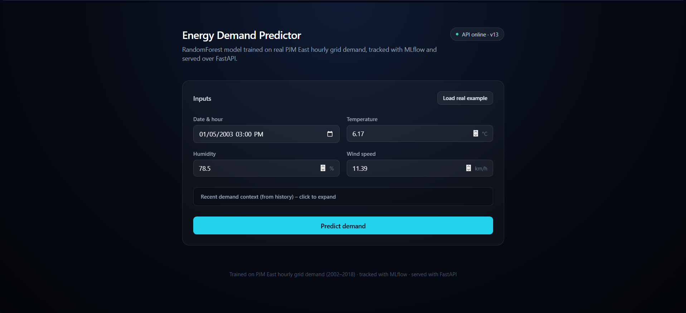

# Energy Demand Predictor

An end-to-end MLOps project that forecasts hourly electricity grid demand:
real PJM East load data, a tracked and versioned training pipeline,
champion/challenger retraining, and a served model behind a public web UI.

**Live demo:** [energydemandpredictor.vercel.app](https://energydemandpredictor.vercel.app)
**API:** [energy-demand-predictor-9vvq.onrender.com/docs](https://energy-demand-predictor-9vvq.onrender.com/docs)



## What it does

Given a timestamp, recent weather, and recent demand history, the model
predicts the next hour's grid load in megawatts. The demo UI loads a real
historical snapshot (actual date, weather, and demand from the dataset),
lets you tweak the inputs, and shows the prediction next to what actually
happened — a RandomForest trained on 16 years of PJM East hourly data
(2002–2018) comes in at **~0.9% MAPE** on the held-out test set.

## Architecture

```
Kaggle (PJM grid data)
       │
       ▼
 fetch_data.py ──▶ features.py ──▶ train.py ──▶ MLflow tracking (sqlite)
                                        │              │
                                        │              ▼
                                        │       model registry + @champion alias
                                        │              │
                        retrain_pipeline.py ◀──────────┘
                     (champion/challenger, on a schedule
                      via the Airflow DAG in dags/)
                                        │
                                        ▼
                          export_champion.py → model/ bundle
                                        │
                                        ▼
                       FastAPI (src/serve.py) ──▶ Render
                                        │
                                        ▼
                        Next.js UI (frontend/) ──▶ Vercel
```

- **Training** is tracked with MLflow (params, metrics, the fitted
  preprocessing+model pipeline, and the exact feature schema used) so any
  run is reproducible from the tracking store alone.
- **Retraining** follows a champion/challenger pattern: a new run only
  replaces the serving model if it beats the current champion on test MAE.
- **Orchestration** is an Airflow 3.x TaskFlow DAG that chains
  fetch → validate → build-features → retrain → report on a schedule.
- **Serving** is decoupled from the tracking store — the champion model is
  exported to a small standalone bundle (`model/`) so the deployed API
  doesn't need MLflow, a database, or the multi-hundred-MB run history at
  request time.

## Notable engineering details

- **Feature set**: calendar features with cyclical (sin/cos) encodings so
  hour 23 and hour 0 read as adjacent, plus 1h/2h/3h/24h/168h demand lags
  and 24h/168h rolling stats — the lag/rolling features do most of the
  work on real grid data, since demand is highly autocorrelated.
- **Chronological train/test split** — never shuffled, since this is a
  time series.
- **Data validation** is tiered: blocking checks (schema, duplicate
  timestamps, nulls in the target) stop the pipeline; range/gap checks
  only warn.
- **Kaggle ingestion** normalizes whichever raw file is pulled (Kaggle's
  PJM dataset ships one CSV per grid region, with DST-fold duplicate
  timestamps) into a consistent schema, and pairs real demand data with a
  seeded synthetic-weather model when a real weather dataset isn't merged
  in.
- **Model export sidesteps a Windows-specific mlflow bug**: resolving a
  registry alias (`models:/name@alias`) triggers a double artifact
  download that mis-parses a local Windows path's drive letter as a URI
  scheme. Resolving the alias to its run ID first and loading via
  `runs:/<run_id>/model` avoids it.

## Stack

Python · scikit-learn · MLflow · Airflow 3 · FastAPI · Next.js · Tailwind
· Docker · Render · Vercel

## Setup

Local development, training, retraining, orchestration, and deployment —
see **[SETUP.md](SETUP.md)**.
